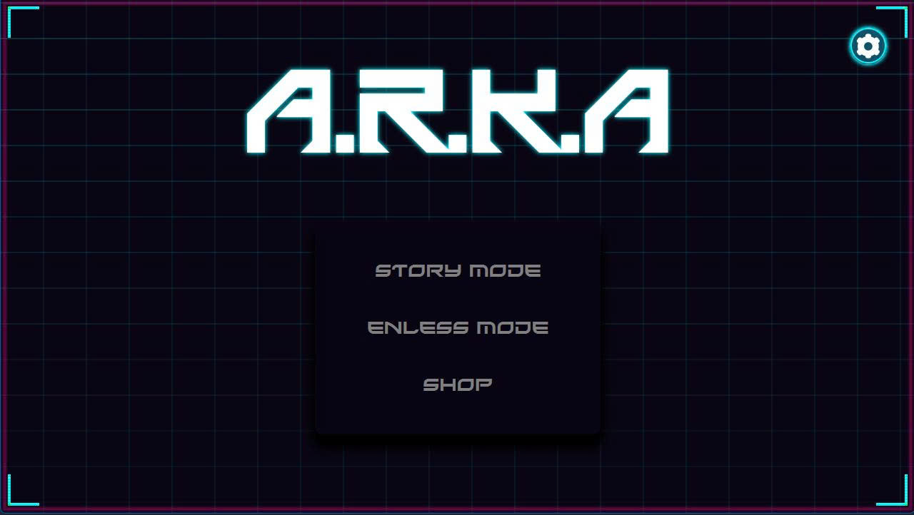
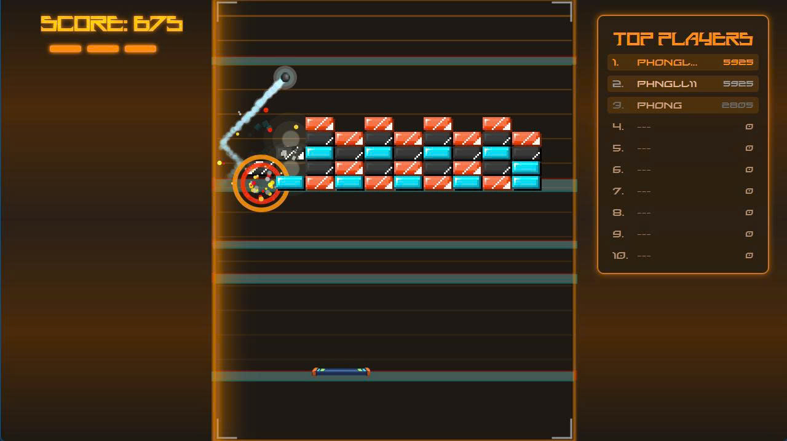
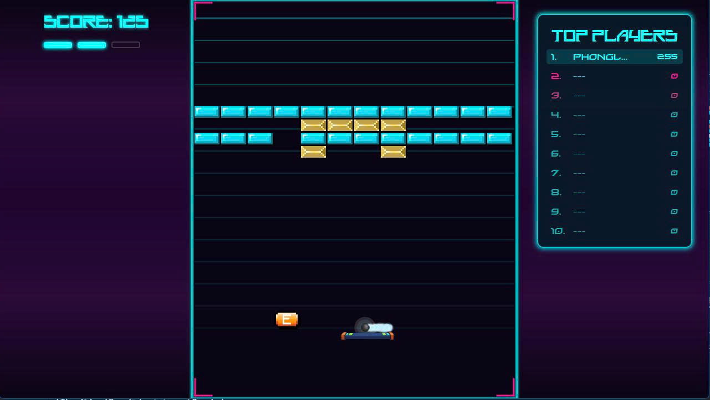
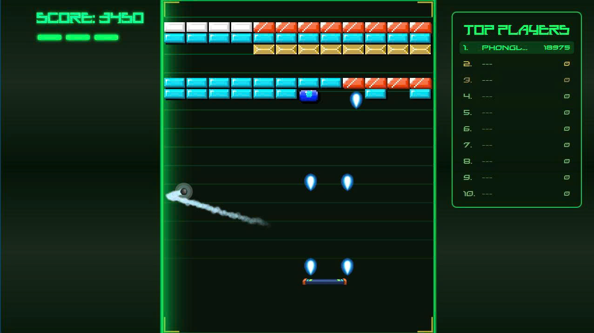
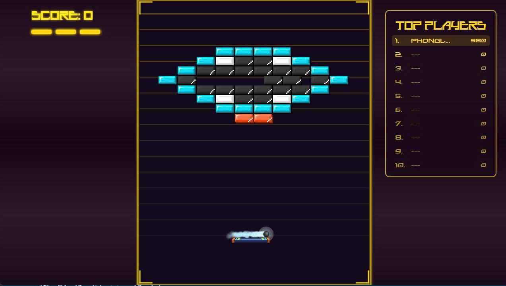
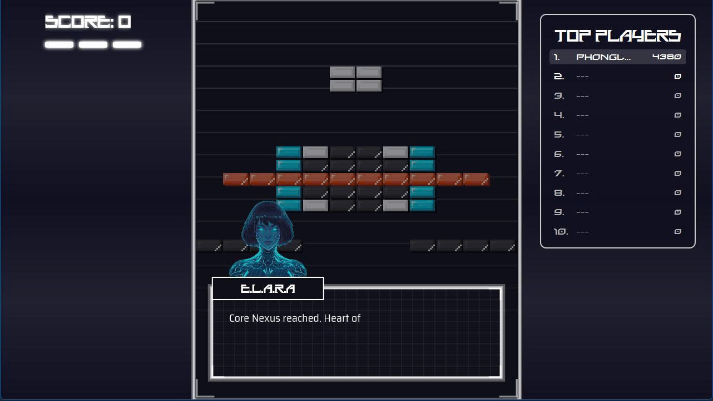
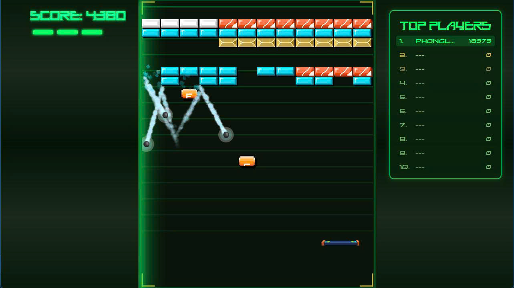

# A.R.K.A -- OOP Project

**Author:** Group 5 -- Class OOP 11
-   Nguyễn Khánh Phong -- 24021594
-   Bùi Quang Minh
-   Trần Duy Hưng
-   Nguyễn Lê Nam Khánh

**Instructor:** Kiều Văn Tuyên
**Semester:** HK1 -- Năm học 2025

---

## 🧩 Description

**A.R.K.A** (short for *Advanced Reactive Kinetic Arkanoid*) is a modern remake of the classic Arkanoid game, developed in **Java 21** with **JavaFX** for the graphical user interface.

The project was created as the final assignment for the Object-Oriented Programming course and focuses on demonstrating OOP principles and design patterns through engaging gameplay and an eye-catching visual style.

---

## ✨ Key Features

-   Developed using Java 21+ and JavaFX for GUI
-   Beautiful, vibrant interface with glowing effects and smooth transitions
-   Implements core OOP principles: Encapsulation, Inheritance, Polymorphism, and Abstraction
-   Applies multiple design patterns: Singleton, Factory Method, Strategy, Observer, State, Builder, MVC, Strategy
-   Features multithreading for Audio
-   Includes sound effects, animations, and power-up systems
-   Supports save/load game functionality and leaderboard system

---

## 🎮 Game Mechanics

-   Control a paddle to bounce a ball and destroy bricks
-   Collect power-ups for special abilities
-   Progress through multiple levels with increasing difficulty
-   Score points and compete on the leaderboard

---

## 📊 UML Diagram

You can generate UML diagrams directly in IntelliJ IDEA.
Complete UML diagrams are available in: 📁 `docs/uml/`

---

## 🧠 Design Patterns Implementation

### 1. Singleton Pattern
**Used in:** `GameManager`, `AudioManager`, `ResourceLoader`, `GameSession`
**Purpose:** Ensures only one instance exists throughout the application.

### 2. Factory Method Pattern
**Used in:** `Brick` class hierarchy
**Purpose:** Creates different types of bricks dynamically without specifying exact class.

### 3. Builder Pattern
**Used in:** `LevelManager`
**Purpose:** Simplifies creation of complex level configurations.

### 4. Observer Pattern
**Used in:** `Brick`, `GameSession`, `GameEngine`
**Purpose:** Notifies subscribed objects when state changes (e.g., score update, brick destroyed).

### 5. Strategy Pattern
**Used in:** PowerUp system
**Purpose:** Allows interchangeable behaviors (e.g., FastBall, SlowBall, MultiBall).

---

## ⚙️ Multithreading Implementation

| Thread | Function |
|---|---|
| Game Loop Thread | Updates game logic at 60 FPS |
| Rendering Thread | Handles graphics rendering (JavaFX Application Thread) |
| Audio Thread Pool | Plays sound effects asynchronously |
| I/O Thread | Handles save/load operations without blocking UI |

---

## 🧰 Installation

1.  Clone the project from the repository.
2.  Open the project in IntelliJ IDEA or another Java IDE.
3.  Reload all Maven projects.
4.  Mark the `src` folder as **Source Root**.
5.  Open MySQL and follow the **Database Setup** section.
6.  Open `PlayerDatabase.java` and enter your database password.
7.  Run the main class to start the game.

---

## 🗄️ Database Setup

Run the following SQL commands to create and initialize the **gold_experience** database:

```sql
USE gold_experience;

DROP TABLE IF EXISTS players;

CREATE TABLE IF NOT EXISTS players (
    id INT AUTO_INCREMENT PRIMARY KEY,
    name VARCHAR(100) NOT NULL,
    chapter INT NOT NULL DEFAULT 1,
    level INT NOT NULL DEFAULT 1,
    score INT DEFAULT 0,
    created_at TIMESTAMP DEFAULT CURRENT_TIMESTAMP,
    updated_at TIMESTAMP DEFAULT CURRENT_TIMESTAMP ON UPDATE CURRENT_TIMESTAMP,
    UNIQUE KEY unique_player_level (name, chapter, level),
    INDEX idx_chapter_level_score (chapter, level, score DESC),
    INDEX idx_name (name)
);

DESCRIBE players;

SELECT name, score FROM players WHERE chapter = 1 AND level = 1
ORDER BY score DESC LIMIT 10;

SELECT name, SUM(score) AS total_score FROM players GROUP BY name
ORDER BY total_score DESC LIMIT 10;
```

## **🕹️ Usage**

## Usage

### Controls
| Key | Action |
|-----|--------|
| `←` or `A` | Move paddle left |
| `→` or `D` | Move paddle right |
| `SPACE` | Launch ball / Shoot laser |
| `P` or `ESC` | Pause game |
| `R` | Restart game |
| `Q` | Quit to menu |
---------------------------------------------------------------------

## **💡 How to Play**

1.  From the main menu, choose a **game mode**:

-   **Story Mode:** Select a **chapter** to play.

    -   It's recommended to start from Chapter 1 and progress to  Chapter 5 to fully experience the storyline.

    -   You can choose **New Game** to start fresh or **Load Game** to continue your previous progress.

-   **Endless Mode:** Jump straight into the action and compete for the highest score on the **leaderboard**.

2.  Control the paddle using the **keyboard** or **mouse**.

3.  Launch the ball with **SPACE** or **mouse click**.

4.  Move the ball and bounce it to **destroy bricks** and **collect power-ups**.

5.  Keep the ball above the paddle --- **don't let it fall!
6.  Destroy all destructible bricks to **complete the level**.

## **🧱 Power-ups**
| Icon | Name          | Effect |
|------|---------------|--------|
|  | Expand Paddle | Increases paddle width for 10 seconds |
|  | Tiny Paddle   | Decreases paddle width for 10 seconds |
|  | Fast Ball     | Increases ball speed by 30% |
|  | Slow Ball     | Decreases ball speed by 30% |
|  | 3 Ball        | Spawns 2 additional balls |
| |  Bullet   | Shoot lasers to destroy bricks for 15 seconds |


## **🧾 Scoring System**

-   Each brick destroyed gives **+125 points**.

-   As long as you keep the ball from falling and continue hitting bricks, your **combo multiplier** increases.

-   The longer you maintain the combo, the higher the **bonus points**you earn for each hit.

-   Losing the ball resets your combo.

## **🖼️ Demo**

-   **Main Menu**

> 

-   **Gameplay**

> 
> 
> 
> 
> 

-   **Power-ups in**
>

-   🎥 Full gameplay video: docs/demo/gameplay.mp4

## **🚀 Future Improvements**

1. **Additional game modes**
    - Time attack mode
    - Survival mode with endless levels
    - Co-op multiplayer mode

2. **Enhanced gameplay**
    - Boss battles at end of worlds
    - More power-up varieties (freeze time, shield wall, etc.)
    - Achievements system

3. **Technical improvements**
    - Migrate to LibGDX or JavaFX for better graphics
    - Add particle effects and advanced animations
    - Implement AI opponent mode
    - Add online leaderboard with database backend


## **🧪 Technologies Used**

| Technology | Version | Purpose |
|------------|---------|---------|
| Java | 21+     | Core language |
| JavaFX | 19.0.2  | GUI framework |
| Maven | 3.9+    | Build tool |
| Jackson | 2.15.0  | JSON processing |
## **📜 License**

This project is developed for educational purposes only.\
Please respect your institution's academic integrity policies.

## **🧾 Notes**

Developed as part of the Object-Oriented Programming with Java course.\
All code written by group members under the guidance of **Kiều Văn
Tuyên**. Some assets (images, sounds) are used under fair use for
educational purposes.\
Demonstrates practical application of OOP and design patterns in a
real-world project.

📅 **Last updated:** 12/11/2025
